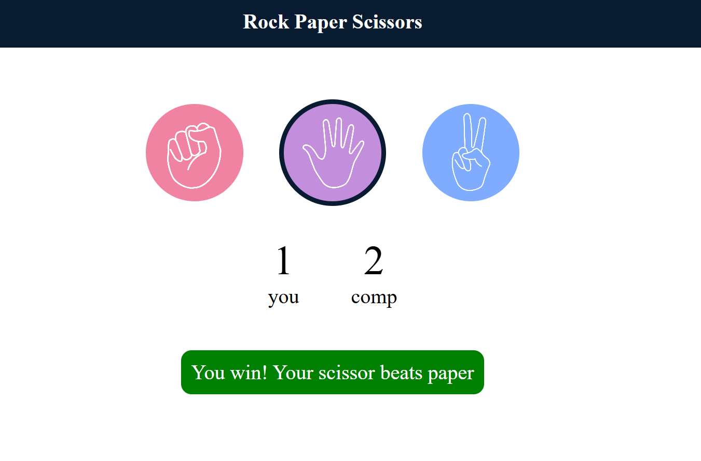

# 🪨 Rock Paper Scissors Game

A responsive and interactive Rock Paper Scissors game built using **HTML, CSS, and JavaScript**.

## 🚀 Features
- Play against the computer
- Random computer moves
- Real-time score updates
- Interactive and responsive user interface
- Simple and user-friendly design

## 🛠️ Technologies Used
- HTML5
- CSS3
- JavaScript 

## 🎮 How to Play
1. Choose **Rock**, **Paper**, or **Scissors**.
2. The computer randomly selects its move.
3. The winner is decided based on the game rules.
4. The score updates automatically after each round.

## 📂 Project Structure
```
├── index.html
├── style.css
├── app.js
└── images/
```

## 📸 Screenshot



## 👨‍💻 Author
**Narendra Nagda**